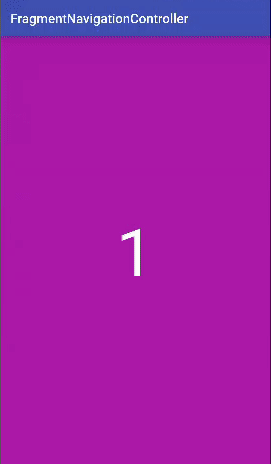

# FragmentNavigationController

[](https://android-arsenal.com/api?level=13)


FragmentNavigationController is a convenient utility class for navigating fragments on Android. It is similar to iOS UINavigationController. FragmentNavigationController manages fragment stack for you. You just use presentFragment() and dismissFragment() method of it. FragmentNavigationController also provides many present styles(transition style) for transition between two fragments.



## Setup Gradle

```groovy
dependencies {
    ...
    compile 'kr.pe.burt.android.lib:fragmentnavigationcontroller:0.0.1'
}
```

## How to use it?

First of all, declare fragment container place in Activity's layout XML file.

```xml
<?xml version="1.0" encoding="utf-8"?>
<LinearLayout xmlns:android="http://schemas.android.com/apk/res/android"
    xmlns:tools="http://schemas.android.com/tools"
    android:layout_width="match_parent"
    android:layout_height="match_parent"
    android:orientation="vertical"
    tools:context="kr.pe.burt.android.androidanimations.MainActivity">


    <FrameLayout
        android:id="@+id/fragmentContainer"
        android:layout_width="match_parent"
        android:layout_height="0dp"
        android:layout_weight="1">
    </FrameLayout>


</LinearLayout>
```

And then, install a FragmentNavigationController in your activity like below:

```java

public class MainActivity extends AppCompatActivity {
	
	...
	
	FragmentNavigationController navigationController;

    @Override
    protected void onCreate(Bundle savedInstanceState) {
        super.onCreate(savedInstanceState);
        setContentView(R.layout.activity_main);

        navigationController = FragmentNavigationController.navigationController(this, R.id.fragmentContainer);
    }
    
    ...
}
```

It's all to use FragmentNavigationController.

## Present and Dismiss Fragment

FragmentNavigationController has cons. to use it. You must inherit your fragment from AndroidFragment which is in FragmentNavigationController package. This is for the beautiful transition effects and others. After inheriting from AndroidFragment, You must implement abstract method `onCreateContentView` where you provide fragment's layout view.

```java
public class FragmentOne extends AndroidFragment {

	 @Nullable
    @Override
    protected View onCreateContentView(LayoutInflater inflater, ViewGroup container, Bundle savedInstanceState) {
        return inflater.inflate(R.layout.fragment_one, container, false);
    }
    
}
```

* Present Fragment

```java
navigationController.presentFragment(new FragmentOne());
```

* dismiss Fragment

```java
navigationController.dismissFragment()
```

## Set the present style, duration and interpolator.

You can set the present style, duration and interpolator whatever you want. 

### Present Style

Using setPresentStyle() method, you can set many present style for fragment transition. There are 40 preset present style for you. Also you can set your custom present style by using animator xml files.

```java
navigationController.setPresentStyle(PresentStyle.ACCORDION_LEFT);
```

### Duration and Interpolator

Using setDuration() and setInterpolator() method, you can set the duration of present animation and the interpolator for the animation. 

```java
navigationController.setDuration(500);
navigationController.setInterpolator(new AccelerateDecelerateInterpolator());
```

### The list of present style

* `NONE`
* `ACCORDION_LEFT`
* `ACCORDION_RIGHT`
* `ACCORDION_UP`
* `ACCORDION_DOWN`
* `CARD_FLIP_LEFT`
* `CARD_FLIP_RIGHT`
* `CARD_FLIP_UP`
* `CARD_FLIP_DOWN`
* `CUBE_LEFT`
* `CUBE_RIGHT`
* `CUBE_UP`
* `CUBE_DOWN`
* `FADE`
* `GLIDE`
* `ROTATE_DOWN_LEFT`
* `ROTATE_DOWN_RIGHT`
* `ROTATE_UP_LEFT`
* `ROTATE_UP_RIGHT`
* `ROTATE_LEFT_UP`
* `ROTATE_LEFT_DOWN`
* `ROTATE_RIGHT_UP`
* `ROTATE_RIGHT_DOWN`
* `SCALEX`
* `SCALEY`
* `SCALEXY`
* `SLIDE_LEFT`
* `SLIDE_RIGHT`
* `SLIDE_UP`
* `SLIDE_DOWN`
* `STACK_LEFT`
* `STACK_RIGHT`
* `TABLE_LEFT`
* `TABLE_RIGHT`
* `TABLE_UP`
* `TABLE_DOWN`
* `ZOOM_FROM_LEFT_TOP_CORNER`
* `ZOOM_FROM_RIGHT_TOP_CORNER`
* `ZOOM_FROM_LEFT_BOTTOM_CORNER`
* `ZOOM_FROM_RIGHT_BOTTOM_CORNER`

## Manage back button and fragment stack.

You should manage back button and fragment stack by manually like below:

```java
@Override
public void onBackPressed() {
    if(navigationController.dismissFragment() == false) {
        super.onBackPressed();
    }
}
```

## APIs

### FragmentNavigationController

* setPresentStyle(int style)
* setPresentStyle(PresentStyle style)
* setInterpolator(Interpolator interpolator)
* setDuration(long presentDuration)
* pushFragment(AndroidFragment fragment)
* popFragment()
* presentFragment(AndroidFragment fragment)
* presentFragment(AndroidFragment fragment, boolean withAnimation)
* dismissFragment()
* dismissFragment(boolean withAnimation)
* popToRootFragment()

## MIT License

## MIT License

The MIT License

Copyright © 2015 Sungcheol Kim, http://github.com/skyfe79/FragmentNavigationController

Permission is hereby granted, free of charge, to any person obtaining a copy
of this software and associated documentation files (the "Software"), to deal
in the Software without restriction, including without limitation the rights
to use, copy, modify, merge, publish, distribute, sublicense, and/or sell
copies of the Software, and to permit persons to whom the Software is
furnished to do so, subject to the following conditions:

The above copyright notice and this permission notice shall be included in
all copies or substantial portions of the Software.

THE SOFTWARE IS PROVIDED "AS IS", WITHOUT WARRANTY OF ANY KIND, EXPRESS OR
IMPLIED, INCLUDING BUT NOT LIMITED TO THE WARRANTIES OF MERCHANTABILITY,
FITNESS FOR A PARTICULAR PURPOSE AND NONINFRINGEMENT. IN NO EVENT SHALL THE
AUTHORS OR COPYRIGHT HOLDERS BE LIABLE FOR ANY CLAIM, DAMAGES OR OTHER
LIABILITY, WHETHER IN AN ACTION OF CONTRACT, TORT OR OTHERWISE, ARISING FROM,
OUT OF OR IN CONNECTION WITH THE SOFTWARE OR THE USE OR OTHER DEALINGS IN
THE SOFTWARE.